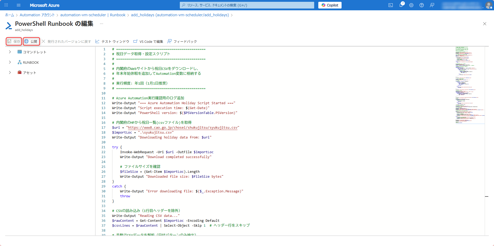
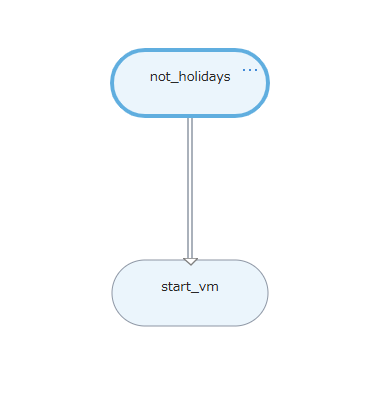
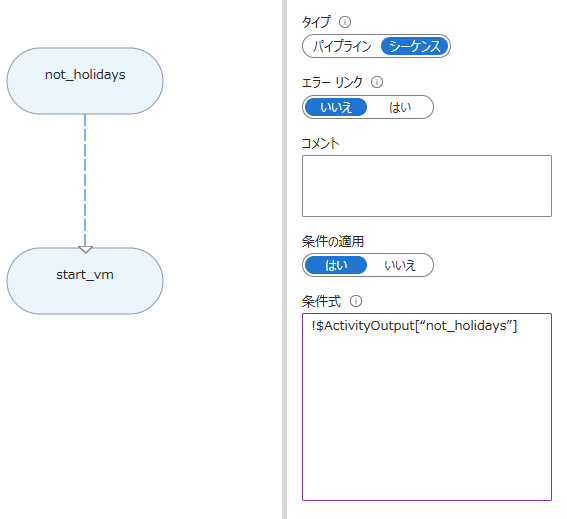

# Azure Automation 祝日判定付き VM 自動起動/停止 詳細セットアップガイド

このドキュメントでは、Azure Automation を使用した祝日判定付き VM 自動起動/停止システムの詳細な構築手順を説明します。

## 📋 目次

1. [事前準備](#事前準備)
2. [Azure Automation アカウントの作成](#azure-automationアカウントの作成)
3. [必要なモジュールのインポート](#必要なモジュールのインポート)
4. [Automation 変数の設定](#automation変数の設定)
5. [Runbook の作成](#runbookの作成)
6. [Graphical Runbook の設定](#graphical-runbookの設定)
7. [スケジュールの設定](#スケジュールの設定)
8. [動作確認](#動作確認)
9. [初期設定](#初期設定)

## 事前準備

### 必要な権限の確認

- Azure サブスクリプションの Contributor 権限以上
- 対象リソースグループへの読み取り・書き込み権限
- VM 操作権限

### テスト環境の準備

1. **テスト用 VM の作成**

   - 停止しても業務に影響しない VM を準備
   - リソースグループを明確に分離
   - VM の名前を控えておく

2. **リソースグループの確認**
   ```bash
   # Azure CLIでリソースグループの確認
   az group list --output table
   ```

## Azure Automation アカウントの作成

### ステップ 1: Automation アカウントの作成

1. **Azure Portal にログイン**

   - https://portal.azure.com にアクセス

2. **Automation アカウントの検索**

   - 上部の検索バーに「Automation アカウント」と入力
   - 検索結果から「Automation アカウント」を選択

3. **新しい Automation アカウントの作成**
   - 「+ 追加」または「作成」をクリック
4. **基本設定の入力**

   ```
   サブスクリプション: （自分のサブスクリプション）
   リソースグループ: rg-automation（新規作成推奨）
   名前: automation-vm-scheduler（わかりやすい名前）
   リージョン: Japan East（東日本）
   ```


5. **詳細設定**

   - システム割り当てマネージド ID: 「オン」
   - ユーザー割り当てマネージド ID: 「オフ」

   

6. **確認と作成**
   - 設定内容を確認して「作成」をクリック
   - デプロイ完了まで約 5-10 分待機

### 💡 実行アカウントについて

Azure 実行アカウント（Run As Account）は、Runbook が Azure リソースを操作するために必要な認証情報です。この設定により、PowerShell スクリプトから VM の起動・停止が可能になります。

## 必要なモジュールのインポート

### ステップ 2: PowerShell モジュールのインポート

1. **Automation アカウントへのアクセス**

   - 作成した Automation アカウントを開く

2. **モジュールのインポート状況確認**

   - 左側メニューの「共有リソース」→「モジュール」を選択。以下のモジュールが使用可能か確認。
     「Az.Accounts」
     「Az.Automation」
     「Az.Compute」

   

3. **モジュールのインポート**

   - 「共有リソース」 → 「モジュール」 → 「ギャラリー参照」から必要なモジュールをインポート。

   

### ⚠️ 注意事項

- モジュールのインポートには時間がかかります（各 5-10 分）
- 必ず Az.Accounts を最初にインポートしてください
- エラーが発生した場合は再インポートを試してください

## Automation 変数の設定

### ステップ 3: 必要な変数の作成

1. **変数画面へのアクセス**

   - 作成した Automation のアカウントから「共有リソース」→「変数」を選択

2. **target_resource_group 変数の作成**

   - 「+ 変数の追加」をクリック

   ```
   名前: target_resource_group
   説明: VMの自動起動/停止対象となるリソースグループ名
   タイプ: 文字列
   値: rg-test-vm（実際のリソースグループ名に変更）
   暗号化: いいえ
   ```

   

3. **exclude_VM 変数の作成**

   ```
   名前: exclude_VM
   説明: 自動起動/停止を除外したい仮想マシン名
   タイプ: 文字列
   値: vm-production,vm-critical（除外したいVM名をカンマ区切り）
   暗号化: いいえ
   ```

4. **holidays_JP 変数の作成**
   ```
   名前: holidays_JP
   説明: 日本の祝日リスト（自動更新される）
   タイプ: 文字列
   値: 2025/10/30（任意の初期値）
   暗号化: いいえ
   ```

### 💡 設定例

```
複数のリソースグループを対象にする場合:
target_resource_group: rg-vm-dev,rg-vm-test

複数のVMを除外する場合:
exclude_VM: vm-production-web,vm-production-db,vm-backup
```

## Runbook の作成

### ステップ 4: PowerShell Runbook の作成

#### 4-1. add_holidays Runbook の作成

1. **Runbook 作成**

   - 「プロセス オートメーション」→「Runbook」を選択
   - 「+ Runbook の作成」をクリック

   

   ```
   名前: add_holidays
   Runbook の種類: PowerShell
   ランタイムバージョン: 5.1
   説明: 内閣府から祝日データを取得してAutomation変数に格納
   ```

2. **スクリプトの入力**

   - `scripts/add_holidays.ps1` の内容をコピー&ペースト
   - 「保存」をクリック
   - 「公開」をクリック

   

#### 4-2. not_holidays Runbook の作成

1. **Runbook 作成**

   ```
   名前: not_holidays
   Runbook の種類: PowerShell
   説明: 実行日が祝日かどうかを判定
   ```

2. **スクリプトの入力**
   - `scripts/not_holidays.ps1` の内容をコピー&ペースト
   - 「保存」→「公開」

#### 4-3. start_vm Runbook の作成

1. **Runbook 作成**

   ```
   名前: start_vm
   Runbook の種類: PowerShell
   説明: 対象VMの自動起動
   ```

2. **スクリプトの入力**
   - `scripts/start_vm.ps1` の内容をコピー&ペースト
   - 「保存」→「公開」

#### 4-4. stop_vm Runbook の作成

1. **Runbook 作成**

   ```
   名前: stop_vm
   Runbook の種類: PowerShell
   説明: 対象VMの自動停止
   ```

2. **スクリプトの入力**
   - `scripts/stop_vm.ps1` の内容をコピー&ペースト
   - 「保存」→「公開」

## Graphical Runbook の設定

### ステップ 5: holiday_automation Runbook の作成

#### 5-1. Graphical Runbook の作成

1. **Runbook 作成**

   ```
   名前: holiday_automation
   Runbook の種類: グラフィカル PowerShell
   ランタイムバージョン: 5.1
   説明: 祝日判定と条件分岐によるVM起動制御
   ```

2. **編集画面を開く**
   - 作成した Runbook をクリック
   - 「編集」をクリック

#### 5-2. アクティビティの追加

1. **左側の Runbook 一覧から追加**

   - 「すべて」を展開
   - 「not_holidays」の「...」→「キャンバスに追加」
   - 「start_vm」の「...」→「キャンバスに追加」

   

2. **接続線の設定**

   - 「not_holidays」の右下の赤丸から「start_vm」へ線を引く

   

#### 5-3. 条件分岐の設定

1. **リンクの設定**

   - 接続線（青い矢印部分）をクリック
   - 右側のプロパティで以下を設定:

   ```
   タイプ: シーケンス
   条件の適用: はい
   条件式: !$ActivityOutput["not_holidays"]
   ```

   

2. **設定の保存**
   - 「保存」をクリック
   - 「公開」をクリック

### 💡 条件式の説明

`!$ActivityOutput["not_holidays"]` は以下を意味します:

- `$ActivityOutput["not_holidays"]`: not_holidays の実行結果を取得
- `!`: 論理否定（NOT の意味）
- 祝日の場合: `not_holidays`は`true`を返すので、`!true`=`false`で VM 起動しない
- 平日の場合: `not_holidays`は`false`を返すので、`!false`=`true`で VM 起動する

## スケジュールの設定

### ステップ 6: 各 Runbook のスケジュール設定

#### 6-1. add_holidays のスケジュール設定

1. **Runbook のスケジュール画面**

   - `add_holidays` Runbook を選択
   - 「スケジュール」をクリック
   - 「+ スケジュールの追加」をクリック

   

2. **スケジュールの作成**

   - 「スケジュールを Runbook にリンクします」をクリック
   - 「新しいスケジュールを作成します。」をクリック

   ```
   名前: Annual-Holiday-Update
   説明: 祝日データ更新
   開始: 2025年10月31日 10:00
   タイムゾーン: (UTC+09:00) 大阪、札幌、東京
   繰り返し: はい
   繰り返し間隔: 1 月
   詳細設定:
     - 月の指定した日に実行: 1
     - 月の最終日に実行: いいえ
   ```

   

#### 6-2. holiday_automation のスケジュール設定

1. **スケジュールの作成**
   ```
   名前: Weekday-VM-Startup
   説明: 平日のVM自動起動
   開始: （翌営業日） 08:00:00
   タイムゾーン: (UTC+09:00) 大阪、札幌、東京
   繰り返し: はい
   繰り返し間隔: 1 週
   設定曜日: 月曜日、火曜日、水曜日、木曜日、金曜日
   ```

#### 6-3. stop_vm のスケジュール設定

1. **スケジュールの作成**
   ```
   名前: Daily-VM-Shutdown
   説明: 毎日のVM自動停止
   開始: （翌日） 20:00:00
   タイムゾーン: (UTC+09:00) 大阪、札幌、東京
   繰り返し: はい
   繰り返し間隔: 1 日
   ```

### ⚠️ スケジュール設定の注意点

- **開始時刻**: 必ず未来の日時を設定してください
- **タイムゾーン**: JST（日本標準時）を選択してください
- **業務時間**: 実際の業務時間に合わせて調整してください

## 動作確認

### ステップ 7: 設定内容の確認とテスト

#### 7-1. 変数の確認

1. **設定内容の確認**

   - 「共有リソース」→「変数」で以下を確認:

   ```
   ✓ target_resource_group: 実際のリソースグループ名
   ✓ exclude_VM: 除外したいVM名
   ✓ holidays_JP: 任意の初期値
   ```

#### 7-2. Runbook の確認

1. **作成済み Runbook の確認**

   - 「プロセス オートメーション」→「Runbook」で以下を確認:

   ```
   ✓ add_holidays (PowerShell) - 公開済み
   ✓ not_holidays (PowerShell) - 公開済み
   ✓ start_vm (PowerShell) - 公開済み
   ✓ stop_vm (PowerShell) - 公開済み
   ✓ holiday_automation (グラフィック) - 公開済み
   ```

#### 7-3. 手動実行によるテスト

1. **祝日データの初期設定**

   - `add_holidays` Runbook を開く
   - 「開始」をクリック
   - 実行完了を確認（約 2-3 分）
   - 「共有リソース」→「変数」→「holidays_JP」の値が更新されることを確認

2. **祝日判定のテスト**

   - `not_holidays` Runbook を手動実行
   - 出力で祝日判定結果を確認

3. **VM 停止のテスト**

   - テスト用 VM が起動していることを確認
   - `stop_vm` Runbook を手動実行
   - VM が停止することを確認

4. **統合テスト**
   - テスト用 VM を停止状態にする
   - 変数 `holidays_JP` を一時的に今日以外の日付に変更
   - `holiday_automation` Runbook を手動実行
   - VM が起動することを確認
   - 変数を元に戻す

## 初期設定

### ステップ 8: 本格運用前の準備

#### 8-1. 本番設定への変更

1. **リソースグループの設定**

   ```
   # 変数の更新
   target_resource_group: rg-production-vm
   exclude_VM: vm-critical-system,vm-database-primary
   ```

2. **時刻の調整**
   - スケジュールを実際の業務時間に合わせて調整
   - 起動時刻: 業務開始 30 分前
   - 停止時刻: 業務終了時刻

#### 8-2. モニタリングの設定

1. **実行履歴の確認方法**

   - 各 Runbook → 「ジョブ」で実行履歴を確認
   - エラーがないかチェック

2. **アラートの設定（オプション）**
   - Azure Monitor で Runbook 失敗時のアラートを設定

### ✅ チェックリスト

運用開始前に以下を確認してください:

- [ ] すべてのモジュールがインポート済み
- [ ] 3 つの変数が正しく設定済み
- [ ] 5 つの Runbook が作成・公開済み
- [ ] スケジュールが設定済み
- [ ] 祝日データが初期設定済み（add_holidays 実行済み）
- [ ] テスト実行で問題なし
- [ ] 本番設定に更新済み

---

**次へ**: 運用中に問題が発生した場合は [トラブルシューティング](troubleshooting.md) を参照してください。
